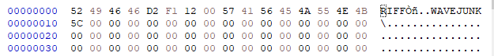
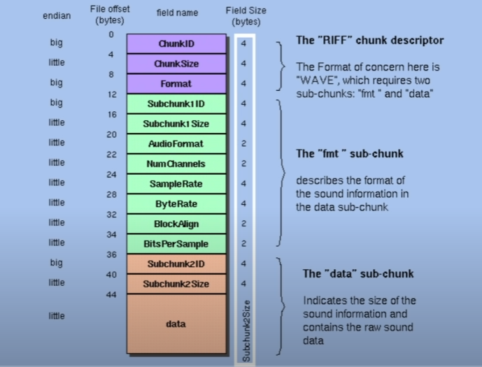

# 背景提要

由于需要画wav文件的波形图，所以就需要拿到wav的波形数据。Unity内部是有从audioclip拿数据画波形的方法的，但是奈何在引擎内部，涉及到C++层，使用多有不便。自己画倒也简单，先拿到采样数据，然后画到texture上即可。所以主要是两个函数。

+ 获取wav采样数据

+ draw

wav的文件解析是件繁琐的事情，于是就上GitHub上找了个轻量的[库](https://github.com/deadlyfingers/UnityWav)，毕竟这种小需求，不想把整个NAudio导入。可以将wav转audioclip。然后在官方[论坛](https://forum.unity.com/threads/how-to-create-waveform-texture-from-audioclip.631480/)里，找到绘制audioclip的方法，很轻松啊，整合一下就可以了，不愧是大自然的搬运工。

## 问题出现

但用了一段时间后，收到反馈有些音频显示正常，有些显示错误。奇了怪了，调试后发现

```c#
UInt16 audioFormat = BitConverter.ToUInt16 (fileBytes, position+4);
if (audioFormat != 1 && audioFormat != 65524) return null;
```

发现有些音频的format不为1，第一直觉认为是其他格式没被支持。通过对比二进制文件才发现不同wav文件的格式竟然就不一样。




按我找的格式图，完全不一样啊 ，这个JUNK是什么呢？




通过查阅[riff](https://www.daubnet.com/en/file-format-riff)发现[wiki](https://zh.wikipedia.org/wiki/%E8%B3%87%E6%BA%90%E4%BA%A4%E6%8F%9B%E6%AA%94%E6%A1%88%E6%A0%BC%E5%BC%8F)

	Structure of the 'JUNK' chunk
	To align RIFF chunks to certain boundaries (i.e. 2048bytes for CD-ROMs) the RIFF specification 	includes a JUNK chunk. Its contents are to be skipped when reading. When writing RIFFs, JUNK 	chunks should not have odd number as Size.

wav都是按照这种块结构排列的，基本结构都是

```c#
 标识符-size-data
 riff -50 - data
```

同样chunk之间还支持嵌套，有点像网络协议的格式。

甚至块内支持不同的编码格式，可以想象wav的设计很大程度是为了兼容和通用性。这个垃圾块单纯只是为了占位，很难想象全世界光这个垃圾块能占走多少资源。知道问题就比较好处理了。

## 解决

这就只需要修改解析模块的代码，让其支持到不同的chunk就可以。[github](https://github.com/SuperSuperPepper/UnityWav)并且在操作上，可以省略转换wav到audioclip这一步。能稍微的优化一些。并在库里扩展了只获取采样数据的方法。


## 参考：

[riff](https://www.daubnet.com/en/file-format-riff)

[wiki](https://zh.wikipedia.org/wiki/%E8%B3%87%E6%BA%90%E4%BA%A4%E6%8F%9B%E6%AA%94%E6%A1%88%E6%A0%BC%E5%BC%8F)

[二进制文件查看工具hxd](https://mh-nexus.de/en/)

[github code](https://github.com/SuperSuperPepper/UnityWav)

[wav format](https://tech.ebu.ch/docs/tech/tech3306v1_0.pdf)

---
辣椒酱

2021.10.28

更多内容在[博客](http://www.lajiaoyuzhou.com/)

