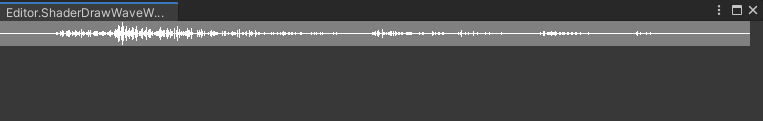

接上一篇，拿到wav波形数据之后，就可以通过读取数据大小来绘制波形图。

## 原理

波形数据可以简单理解为一个音频频率数组。索引就是波形的X轴，频率就是波形的Y轴。

很显然数组的索引是远远大于texture的宽度的。毕竟1k的分辨率宽也就1920。这就涉及到一个重新采样的问题。将原有的数组重新采样为我们绘制texture的宽度。

宽度有了，再来说高度。音频频率存的是0-1之间的浮点数。可以像lerp到高度上面，我们想要上下对称，只需要把高度按一半来计算，上下对照绘制就可以。

为了支持波形图的缩放与偏移，我们再引进两个参数，来表明波形展示在音频中的起始点，和绘制长度。有了这两个参数，我们可以把全部的数据截断为我们需要绘制这一段的数据。就达到了只绘制音频中某一片段的目的。

### CPU实现

实现代码：

```
  public void CpuDrawWave(Texture2D _texture,float[] samples,float[] waveform,int s1, int s2, Color waveColor)
        {
            int packSize = ( (s2-s1) / 750 ) + 1;
            int s = 0;
            for (int i = s1; i <s2; i += packSize) {
                waveform[s] = Mathf.Abs(samples[i]);
                s++;
            }
            Color bgColor =Color.gray;
            for (int x = 0; x < 750; x++) {
                for (int y = 0; y < 25; y++) {
                    _texture.SetPixel(x, y, bgColor);
                }
            }
 
            for (int x = 0; x < waveform.Length; x++) {
                for (int y = 0; y <= waveform[x] * ((float)25 * .75f); y++) 
                {
                    _texture.SetPixel(x, ( 25 / 2 ) + y, waveColor);
                    _texture.SetPixel(x, ( 25 / 2 ) - y, waveColor);
                }
            }
            _texture.Apply();
        }
```

这样我们的第一代版本就完成了。

很显然有点经验的同学一看代码就闻到了“耗时”的味道。如果只花一张图还好，如果像Timeline的音频轨道那样，一个clip都要画一个，性能开销还是很大的。即便上述的代码还有一点优化的空间，可以将绘制背景色的循环和绘制波形放到一起，那么仍然剩下的3个For循环和SetPixel这样的耗时操作。

那么自然的，CPU不行，当然是要GPU出马,毕竟这个时代，单张显卡的价格，都够配一台除了显卡的主机了。花了这么多钱可不能让他闲着。

可以通过shader来进行绘制Texture这一步，这样我们就能省下两个for循环。在Vertex中修改uv，让uv的xy作为我们波形图的xy轴。

在Fragment中我们来着色。

### Shader实现

```
   			VertexOutput Vertex(VertexInput i)
            {
               VertexOutput o;

                o.pos = i.vertex;
                o.pos.xy = o.pos.xy * 2 - 1;
                o.uv = i.uv;
                //先求反，然后上下分为正负0-0.5 *2 变为 (-1)-0-1
                //o.uv.y = abs((1.0 - o.uv.y)-0.5)*2; 
                o.uv.y = ((1.0 - o.uv.y)-0.5)*2;
                return o;             
            }
                     
            
            half4 Fragment(VertexOutput i):SV_Target
            {
                float value =_sampleArray[floor(i.uv.x *750)];
                // abs must set in fragment
                if (abs(i.uv.y)< max(value,0.05))
                {
                    return half4(_ColorWave);
                }                
                else{
                    return half4(_ColorBg);
                }                                                                                                                                    
            }
```

但是shader有个很大的问题是shader中的数组长度一定要事先声明好，因为我们音频数据的长度是不定的。所以我们重采样这一步就没法放到shader里面来计算。只能将重采样后的数据传入shader。

那能不能再快点，毕竟重采样这一步也是一个大的for循环。这个时候就需要compute shader 出马。因为compute shader 可以接受 ComputeBuffer 参数。这个buffer是可以边长的，那这样就可以把整个音频的数据传进去，而不是把采样过后的数据传进到GPU。很显然速度会更快一筹。

同样的我们借助Step和Lerp函数，去掉shader中的if判断。让速度快上加快。Compute Shader 的语法这里就不详述了，毕竟讲这块的资料太多了。

### Compute Shader

```
RWTexture2D<float4> Result;
RWStructuredBuffer<float> Samples;
RWStructuredBuffer<float> Waves;
vector<float, 4> WaveColor;
vector<float, 4> BgColor;
int Offset;
int PackSize; 

[numthreads(8,8,1)]
void DrawWave (uint3 id : SV_DispatchThreadID)
{
    uint width,height;
    Result.GetDimensions(width,height);

    float2 uv =float2(id.xy/float2(width,height));
    uv.y = abs(((1.0 - uv.y)-0.5)*2);
    //重采样
    float value =abs(Samples[Offset+floor(uv.x *width*PackSize)]);
     
    Result[id.xy] =lerp(half4(BgColor.x,BgColor.y,BgColor.z,1),half4(WaveColor.x,WaveColor.y,WaveColor.z,1),step(uv.y,max(value,0.05)));
    
    /*    
    if (uv.y< max(value,0.05))
    {
          Result[id.xy] = half4(WaveColor.x,WaveColor.y,WaveColor.z,1);
    }                
    else{
          Result[id.xy] = half4(BgColor.x,BgColor.y,BgColor.z,1);
    } 
    */
}
```

### 快了多少

因为使用的音频不同，绘制波形图的数量以及分辨率不同都会影响绘制时间，这里只拿我单一环境下测试的结果显示。都是通过profile截图整理的，由于截图还有其他堆栈信息就不放出来了。

但数据都是真的，这可不是瞎填的噢。

| 类型 | 时间（毫秒） |
| ---- | ---- |
| CPU  | 2.7   |
|Shader|1.64|
|ComputeShader|0.86|
|ComputeShader优化掉if|0.503|

可以很清楚的反映了几种方式的耗时。

具体源码放到下面仓库里了。

# Source Code

github:[DrawWave](https://github.com/SuperSuperPepper/DrawWave)


---

辣椒酱

2021.10.28

更多内容在[博客](
